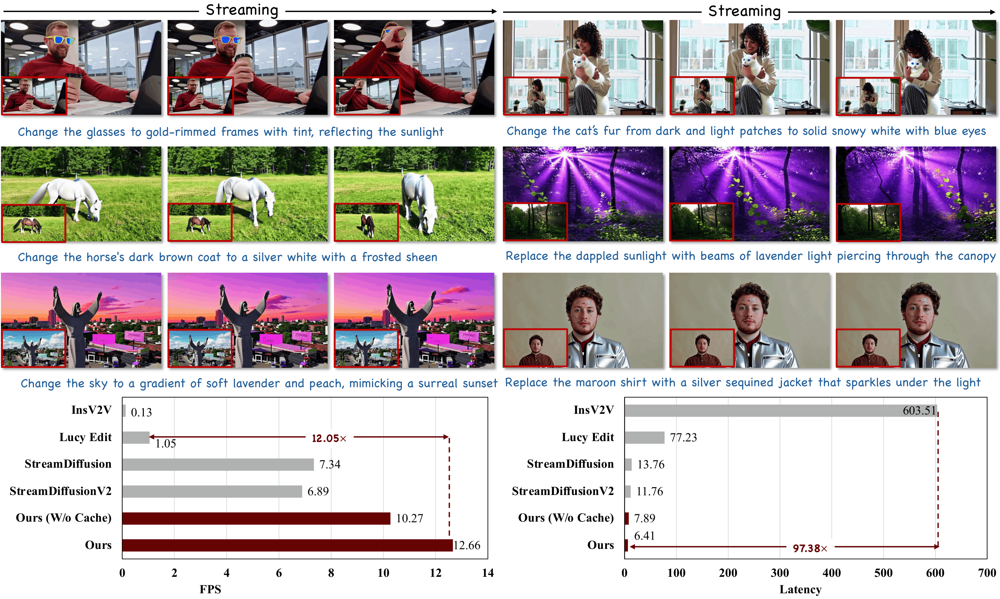

<div align="center">

<h1>LiveEdit</h1>
<h2>Towards Real-Time Diffusion-Based Streaming Video Editing</h2>

Xinyu Wang<sup>1</sup>, Chongbo Zhao<sup>1</sup>, Fangneng Zhan<sup>2</sup>, Yue Ma<sup>2</sup>

<sup>1</sup>THU &nbsp;&nbsp; <sup>2</sup>HKUST

<strong>Accepted by ECCV 2026</strong>

<a href='https://arxiv.org/abs/2606.26740'></a> 
<a href="https://live-edit.github.io"></a>
<a href="https://huggingface.co/cp-cp/LiveEdit/tree/main"></a>


</div>


## 📣 Updates

- **[2026.06.24]** Release README, inference scripts, and Hugging Face checkpoint instructions.
- **[2026.06.24]** Release inference and training code.

## 🔍 Overview




LiveEdit is a diffusion-based framework for streaming video editing. Given a source video and a text editing instruction, LiveEdit performs causal chunk-by-chunk editing while preserving backgrounds and non-edited regions.


## ✨ Highlights

- Real-time-oriented video editing with causal chunk-by-chunk inference.
- Strong source preservation for backgrounds and non-edited regions.
- Three-stage distillation from a bidirectional editing teacher to a streaming student.
- AR-oriented Mask Cache for efficient region-aware computation reuse.
- Built on Wan2.1 and the Self-Forcing codebase.

## 🛠 Getting Started

### 1. Clone the code and prepare the environment

We recommend Linux with NVIDIA GPUs. Single-GPU inference is supported; training scripts are written for multi-GPU `torchrun`.

```bash
conda create -n liveedit python=3.10 -y
conda activate liveedit
pip install -r requirements.txt
pip install flash-attn --no-build-isolation
```

### 2. Download pretrained weights

Download the Wan2.1 base model:

```bash
huggingface-cli download Wan-AI/Wan2.1-T2V-1.3B \
  --local-dir-use-symlinks False \
  --local-dir wan_models/Wan2.1-T2V-1.3B
```

Download the released LiveEdit checkpoint:

```bash
mkdir -p checkpoints/liveedit
huggingface-cli download cp-cp/LiveEdit ar-forcing_002000.pt \
  --local-dir checkpoints/liveedit
```

The released checkpoint should be organized as:

```text
checkpoints/
└── liveedit/
    └── ar-forcing_002000.pt

wan_models/
└── Wan2.1-T2V-1.3B/
```

`ar-forcing_002000.pt` corresponds to the 2000-step self-forcing checkpoint used by `infer-local-ar-forcing.sh`.

### 3. Prepare input videos

For video-to-video editing, prepare a JSON file with source videos and text instructions:

```json
[
  {
    "instruction": "Change the red currants to deep black grapes.",
    "source_path": "./test_cases/test.mp4"
  }
]
```

Example inputs are provided in `test_cases/test.json` and `test_cases/test-long.json`.

### 4. Inference

Run the default LiveEdit inference script:

```bash
bash infer-local-ar-forcing.sh
```

Equivalent command:

```bash
CUDA_VISIBLE_DEVICES=0 python inference-mm.py \
  --config_path configs/wan_mm-ar-forcing-local.yaml \
  --output_folder videos/test \
  --checkpoint_path checkpoints/liveedit/ar-forcing_002000.pt \
  --data_path test_cases/test.json \
  --num_output_frames 21 \
  --task v2v \
  --inference_num_steps 50
```

## 🚀 Efficient Inference with AR-Oriented Mask Cache

The AR-oriented Mask Cache in the paper is exposed through the token-pruning inference config and helper script. It reuses computation in unchanged regions and can optionally save mask visualizations.

```bash
bash infer-token-pruning.sh
```

Equivalent command:

```bash
CUDA_VISIBLE_DEVICES=0 python inference-mm.py \
  --config_path configs/wan_mm-token-pruning.yaml \
  --output_folder videos/mask-cache-test \
  --checkpoint_path checkpoints/liveedit/ar-forcing_002000.pt \
  --data_path test_cases/test.json \
  --num_output_frames 21 \
  --prefix "mask_cache_" \
  --task v2v \
  --save_mask
```

`--save_mask` saves visualizations of the reused and fully computed regions to the output folder.

## ⚙️ Training

LiveEdit uses a three-stage training pipeline:

1. **Foundation Tuning for Editing Ability Acquisition**: trains a strong offline video editing model.
2. **Teacher Forcing for Chunk-wise Causal Initial**: adapts the model to causal chunk-wise editing.
3. **DMD for Streaming Video Editing**: compresses streaming inference to a small number of denoising steps.

Example entry points:

```bash
bash train-mm-bid-diffusion.sh
bash train-mm-ar-diffusion.sh
bash train-mm-ar-forcing.sh
```

Before training, update the config paths for your dataset, Wan2.1 model location, and stage checkpoints.


## 👍 Acknowledgements

This repository builds on [Self-Forcing](https://github.com/guandeh17/Self-Forcing), [CausVid](https://github.com/tianweiy/CausVid), and [Wan2.1](https://github.com/Wan-Video/Wan2.1). We thank the authors for their open-source contributions.


## Citation 💖

If you find this project useful for your research, please cite:

```bibtex
@inproceedings{wang2026liveedit,
  title={LiveEdit: Towards Real-Time Diffusion-Based Streaming Video Editing},
  author={Wang, Xinyu and Zhao, Chongbo and Zhan, Fangneng and Ma, Yue},
  booktitle={European Conference on Computer Vision},
  year={2026}
  organization={Springer}
}
```
